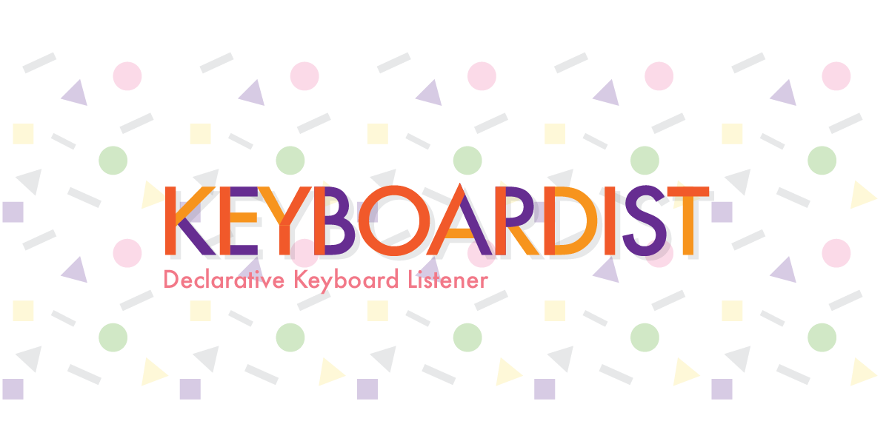

# 🎹 Keyboardist



A declarative way to add keyboard shortcuts to your browser applications.

```javascript
import { createListener } from "keyboardist";

const listener = createListener();

listener.subscribe("Shift+Down", () => {
  console.log("Pressed Shift + down");
});
```

This is the Keyboardist monorepo:

| Package | Description |
| --- | --- |
| [`packages/keyboardist`](packages/keyboardist) | The [`keyboardist`](https://www.npmjs.com/package/keyboardist) npm package — docs live in its [README](packages/keyboardist/README.md) |
| [`apps/website`](apps/website) | The demo website |

For using with React, there's
[React Keyboardist](https://github.com/soska/react-keyboardist).

## Development

Requires Node 24 and [pnpm](https://pnpm.io):

```sh
pnpm install
pnpm check   # lint + typecheck + test + build
```

See [CONTRIBUTING.md](CONTRIBUTING.md) for the full workflow.

## Releases

Versioning and publishing are automated with
[Changesets](https://github.com/changesets/changesets); the changelog lives in
[`packages/keyboardist/CHANGELOG.md`](packages/keyboardist/CHANGELOG.md) once
the first automated release lands.

The pre-monorepo 2.x state of this repository is preserved on the
[`v2` branch](https://github.com/soska/keyboardist/tree/v2) and the
`archive/v2-final` tag.

## License

MIT © [Armando Sosa](https://armandososa.org)
